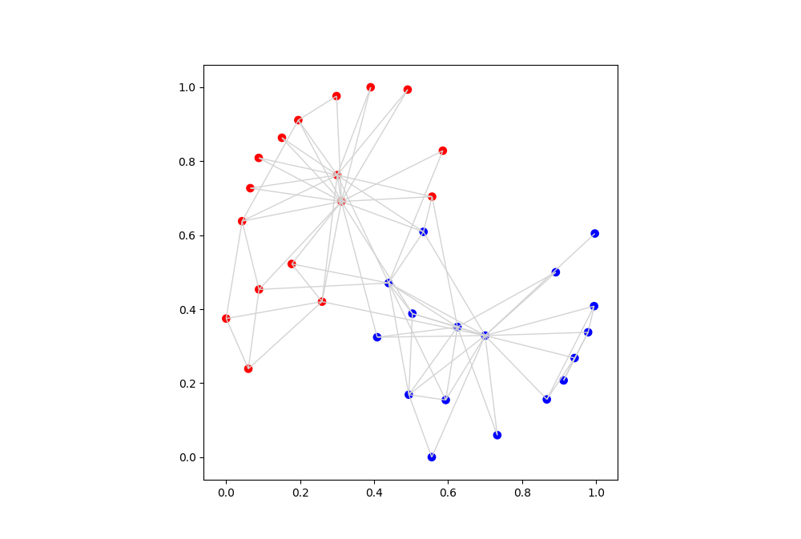

# Mediaviz

This repository is for my project [Automating Network Visualization and community detection of Media Sources Network from Mediacloud data.](https://summerofcode.withgoogle.com/projects/#6265196406898688)  with Google Summer Of Code 2018. The goal is to create network visualizations with force atlas 2 layout and appropriate visual aesthetics on top of python's popular network analysis library networkx. 


# Dependencies : 

* [networkx](https://networkx.github.io)

* [fa2l](https://github.com/bosiakov/fa2l/tree/master/fa2l)

* [adjusttext](http://adjusttext.readthedocs.io)

* [matplotlib](https://matplotlib.org)

* [numpy](http://www.numpy.org/)


# Usage

* Draw a Network with Force Atlas 2 Layout With Default Parameters

```python
import networkx as nx
import os
from mediaviz.visualize import draw_forceatlas2_network

fname = os.path.join(os.path.dirname(__file__), 'graphname.gexf')
G = nx.read_gexf(fname)

draw_forceatlas2_network(G)
```


* Drawing Network with Force Atlas 2 Layout with customized colormap, node size and labels
* Drawing Network With Community Detection and Coloring
* Only Using Draw Function for Customized Visualization

```python
import networkx as nx
from mediaviz.draw import draw_networkx_graph_customized

G = nx.karate_club_graph()

draw_networkx_graph_customized(G,
			       node_sizes=0.01,
			       color_by="club",
			       colormap={"Officer":"r","Mr. Hi":"b"},
                               node_opacity=1,edge_opacity=1, 
                               figsize=(10,10), edge_color="lightgray")
```



* Using the utility functions 


# Blog Posts : 

* [GSOC 2018 Experience : Visualizing Media Data With Network Analysis (PART 1 )](https://medium.com/learning-machine-learning/gsoc-2018-experience-visualizing-media-data-with-network-analysis-part-1-c4ba4b76b1aa)

* [GSOC 2018 : Network Visualization Of MediaCloud Topic Network + 1st evaluation (Part 2)](https://medium.com/learning-machine-learning/gsoc-2018-network-visualization-of-mediacloud-topic-network-1st-evaluation-part-2-ca72e25a88d5)
