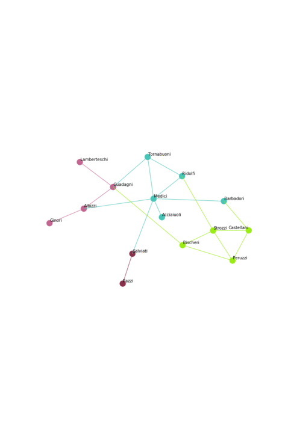
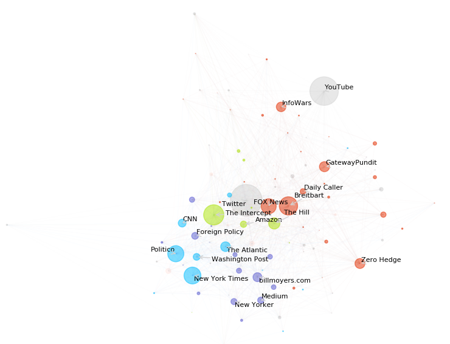
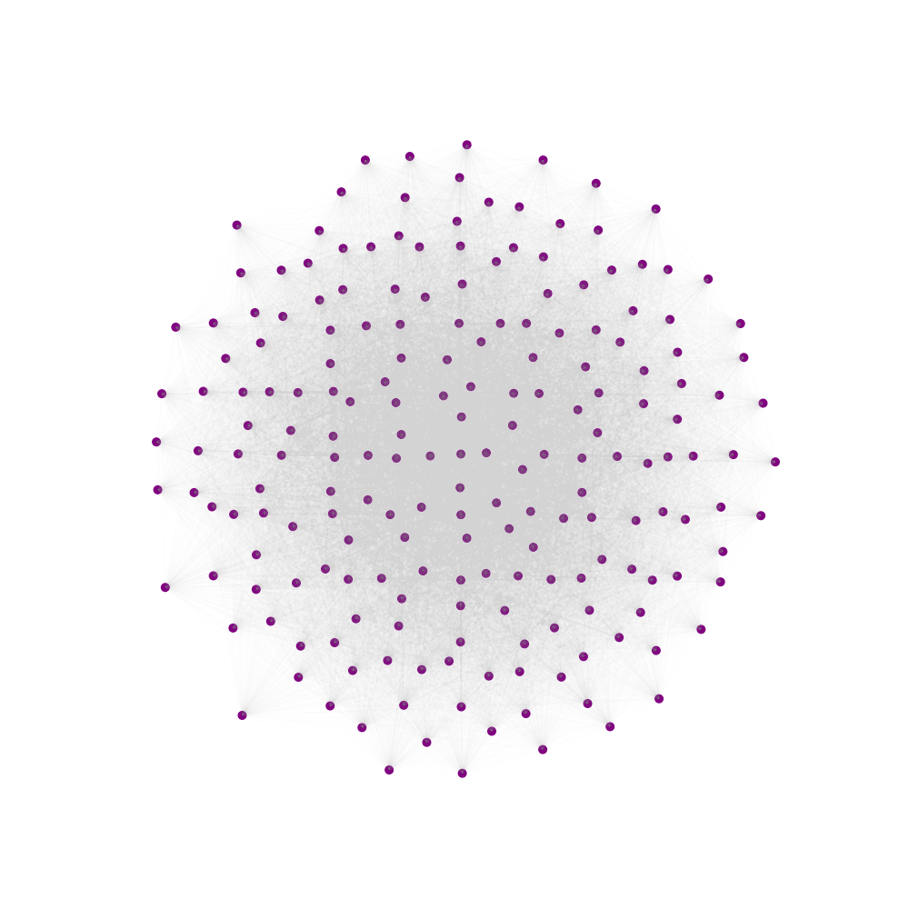
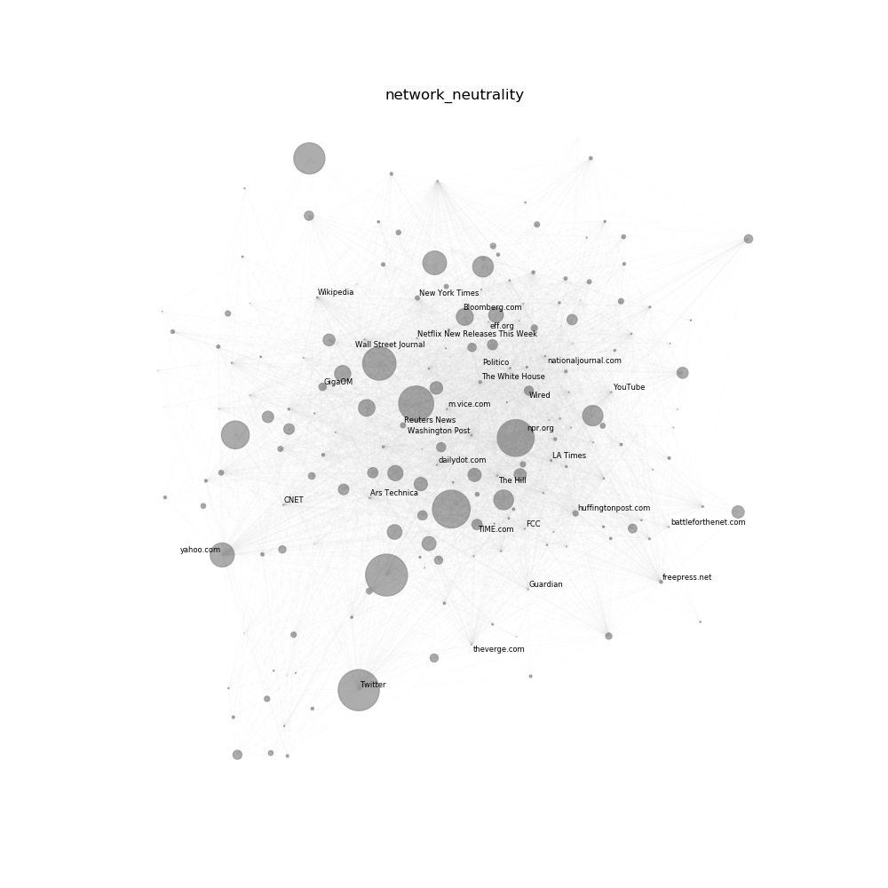
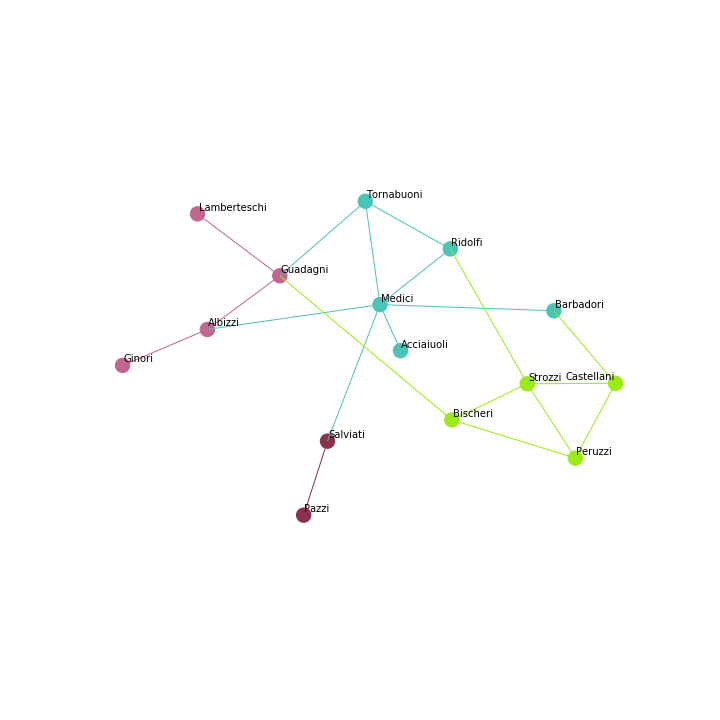
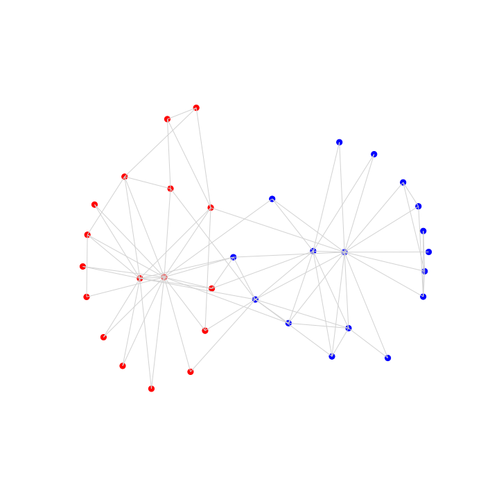

# Mediaviz

Mediaviz is a network visualization library created for my project  [Automating Network Visualization and community detection of Media Sources Network from Mediacloud data](https://summerofcode.withgoogle.com/projects/#6265196406898688) done with [Berkman Klein Center of Internet And Society](http://cyber.law.harvard.edu/) at Harvard University while participating at [Google Summer Of Code 2018](https://summerofcode.withgoogle.com/) under the guidance of mentor [Hal Roberts](http://cyber.harvard.edu/people/hroberts).

[Mediacloud](http://mediacloud.org/) is an open source, open data platform for researchers that provides data and statistics for quantitative analysis. Mediaviz has been originally developed to automate the network visualization of the media source networks for different topics such as network neutrality, ebola and more. 

However, beyond the mediacloud usage, Mediaviz is also a general purpose network visualization library provides functionalities for force based layout such as [force atlas 2](http://journals.plos.org/plosone/article?id=10.1371/journal.pone.0098679), automatic scaling to prevent node overlap, Gephi like features for network filtering, coloring, node resizing, prevention of label overlap and community visualization. 

Mediaviz uses force atlas 2 layout as default and scales the layout automatically for graphs with 100-1000 nodes that has a power law linking structure.  Having sensible defaults, Mediaviz can be used for general graph visualization as well as publishable graphs with many customization parameters including using the drawing function with any other network layout function in networkx or beyond. 

Examples and demo visualizations are provided in the usage section.

# Documentation

Complete Documentation is available at https://mediaviz.readthedocs.io/en/latest/ 





# Installation

To install the package from pip :

```python
pip install mediaviz
```

To build from source , download the repository and go to the Mediaviz top level directory. Then use

```python
python setup.py install 
```

or 

```python
pip install .
```


# Dependencies  

* [networkx](https://networkx.github.io)
* [fa2l](https://github.com/bosiakov/fa2l/tree/master/fa2l)
* [adjusttext](http://adjusttext.readthedocs.io)
* [matplotlib](https://matplotlib.org)
* [numpy](http://www.numpy.org/)
* [python-louvain](https://python-louvain.readthedocs.io/en/latest/)


# Blog Posts

- [GSOC 2018 Experience : Visualizing Media Data With Network Analysis (PART 1 )](https://medium.com/learning-machine-learning/gsoc-2018-experience-visualizing-media-data-with-network-analysis-part-1-c4ba4b76b1aa)
- [GSOC 2018 : Network Visualization Of MediaCloud Topic Network + 1st evaluation (Part 2)](https://medium.com/learning-machine-learning/gsoc-2018-network-visualization-of-mediacloud-topic-network-1st-evaluation-part-2-ca72e25a88d5)


# Usage

####  Draw a Network with Force Atlas 2 Layout With Default Parameters

```python
import networkx as nx
from mediaviz.draw import draw_forceatlas2_network

path= 'graphname.gexf'
G = nx.erdos_renyi_graph(200,0.7)

draw_forceatlas2_network(G,node_colors='purple', node_sizes=10, edge_color='gray',filename="random.png")
```



#### Drawing Network with Force Atlas 2 Layout with customization

Here we parse color codes from .gexf visual attributes.

```python
import networkx as nx
from mediaviz.draw import draw_forceatlas2_network
from mediaviz.viz_parser import parse_colors, parse_size

# 1000 node graph from mediacloud on network neutrality topic
path = "network_neutrality.gexf" 
G = nx.read_gexf(path)
node_colors = list(parse_colors(path,hex=True).values())
draw_forceatlas2_network(G,
     num_labels = 30, # num_labels indicates to only label top 30 largest nodes by node_size
     fa2l_scaling_ratio=40,fa2l_iterations=100, # parameters for the force atlas 2 layout
     node_colors = node_colors, 
     with_labels=True, label_field="label",
     filter_by="inlink_count", top=200, # filter to get top 200 nodes sorted by inlink_count
     size_field = "inlink_count",min_size=0.1,max_size=200, # resize by inlink_count
     adjust_labels=True, # adjusts labels to prevent label overlap
     node_opacity=0.8, edge_opacity=0.01, 
     font_size=6, # size of label font_size 
     filename= "network_neutrality.png", title="network_neutrality",
     edge_color_by_source=True)
```




#### Drawing Network With Community Detection and Coloring By Community Partitions

```python
import community
import networkx as nx
from mediaviz.community_utils import get_community_graph, get_community_colormap
from mediaviz.draw import draw_forceatlas2_network

G = nx.florentine_families_graph() 
# get the community partitions and set partition as an attribute for the nodes 
G, partitions = get_community_graph(G) 
# colormaps are automatically assigned for each partition as randomly genererated hex colors
colormap = get_community_colormap(partitions)
# use the draw function as usual with forceatlas2 layout as default
draw_forceatlas2_network(
        G,
        color_by="partition", colormap=colormap,
        node_sizes = 10,
        with_labels=True, 
        edge_color_by_source=True, node_opacity = 1, edge_opacity = 1,
        font_size=10, filename = "community.png",
        figsize=(10, 10));
```



#### Only Using Draw Function for Customized Visualization With Other Layout Algorithms

```python
import networkx as nx
from mediaviz.draw import draw_forceatlas2_network
G = nx.karate_club_graph()
pos = nx.spring_layout(G)
draw_forceatlas2_network(G,
                         pos = pos,
                         node_sizes=10,
                         color_by="club",
                         colormap={"Officer":"r","Mr. Hi":"b"},
                         node_opacity=1,edge_opacity=1, filename="karate_club.png",
                         edge_color="lightgray")
```




# Contribution and Further Improvement

If you want to contribute please send a pull request with listing the changes you have made and the reasoning clearly stated. Integrating the drawing function with matplotlib better and trying out different heuristics for automated scaling would be a priority.

# License

This project is licensed under the MIT License - see the License.txt file for details.


